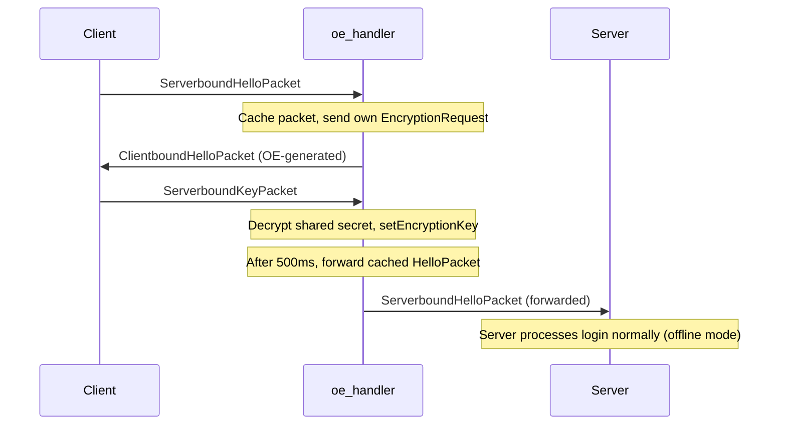
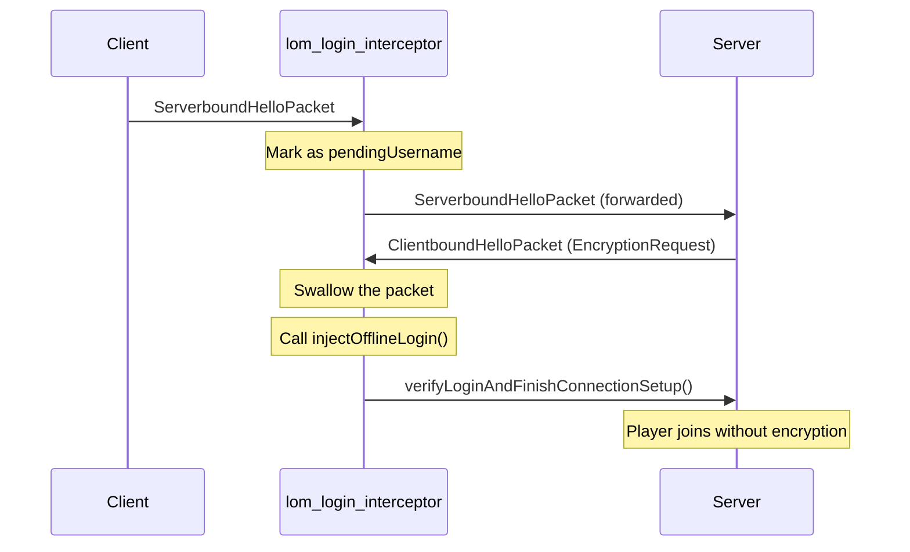
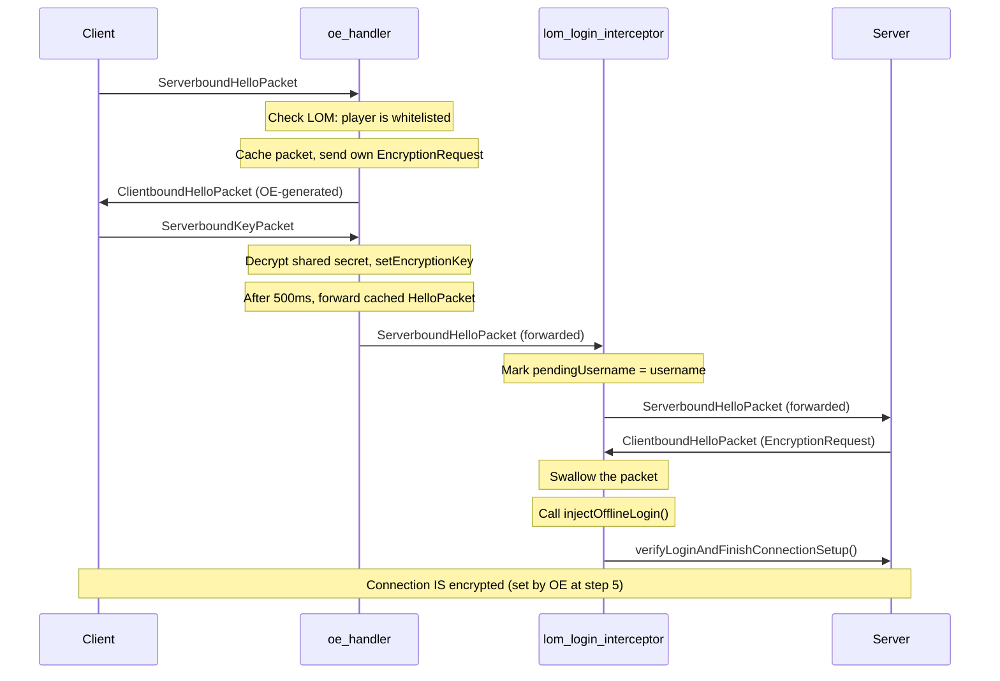
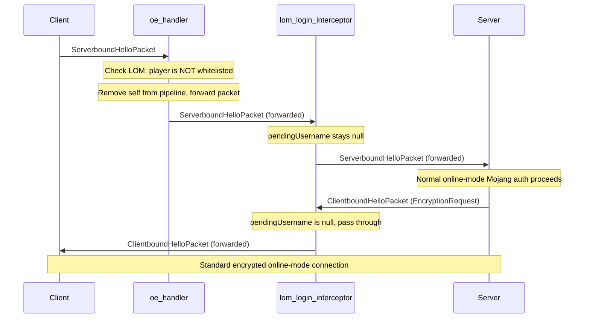

# OfflineEncryptor + LimitedOfflineMode Integration Plan

## Problem Statement

[`OfflineEncryptor`](paper/src/main/java/io/github/lumine1909/offlineencryptor/paper/OfflineEncryptor.java:22-24) currently refuses to start when the server is in **online mode**:

```java
if (Bukkit.getOnlineMode()) {
    throw new IllegalStateException("Encryption is already enabled in online mode!");
}
```

[`LimitedOfflineMode`](https://github.com/chank-op/Limited-offline-mode-Paper) **requires** the server to be in online mode — it intercepts the login flow for whitelisted players and bypasses Mojang authentication, allowing them to join as offline-mode players on an online-mode server.

The user wants these two plugins to work together so that whitelisted offline players get encrypted connections.

## Architecture Analysis

### Current OfflineEncryptor Flow (offline mode)



### Current LimitedOfflineMode Flow (online mode, whitelisted player)



### The Conflict

Both plugins add Netty handlers before `packet_handler` in the pipeline. The handler order determines which plugin processes packets first:

- Pipeline: `... -> oe_handler -> lom_login_interceptor -> packet_handler`
- Inbound (C→S): `oe_handler` sees packets first, then `lom_login_interceptor`
- Outbound (S→C): `lom_login_interceptor` sees packets first, then `oe_handler`

**Key insight:** If `oe_handler` does NOT forward `ServerboundHelloPacket` (because it caches it for encryption), `lom_login_interceptor` never sees it, so `pendingUsername` stays null, and LimitedOfflineMode never intercepts the server's encryption request.

But if `oe_handler` DOES forward the hello packet after encryption is set up, LimitedOfflineMode can see it, mark the username, and later swallow the server's encryption request — while the connection is already encrypted by OfflineEncryptor.

## Proposed Solution

### Design Overview

1. **Detect LimitedOfflineMode** at plugin startup
2. **Skip the online-mode check** when LimitedOfflineMode is present
3. **For whitelisted players**: OfflineEncryptor provides encryption, LimitedOfflineMode bypasses Mojang auth
4. **For non-whitelisted players**: OfflineEncryptor lets the packet pass through, normal online-mode Mojang auth proceeds

### Flow Diagram (with both plugins, whitelisted player)



### Flow Diagram (with both plugins, NON-whitelisted player)



## Files to Modify

### 1. Create `paper/src/main/java/io/github/lumine1909/offlineencryptor/paper/LimitedOfflineModeCompat.java`

A static utility class that detects LimitedOfflineMode via reflection and exposes `isUserAllowed(String username)`.

```java
package io.github.lumine1909.offlineencryptor.paper;

import org.bukkit.Bukkit;
import org.bukkit.plugin.Plugin;
import java.lang.reflect.Method;

public class LimitedOfflineModeCompat {

    private static Boolean present = null;
    private static Method isUserAllowedMethod = null;

    public static boolean isPresent() {
        if (present == null) initialize();
        return present;
    }

    public static boolean isUserAllowed(String username) {
        if (!isPresent() || username == null) return false;
        try {
            Plugin plugin = Bukkit.getPluginManager().getPlugin("LimitedOfflineMode");
            return (boolean) isUserAllowedMethod.invoke(plugin, username);
        } catch (Exception e) {
            return false;
        }
    }

    private static void initialize() {
        try {
            Class.forName("de.moritxius.limitedofflinemode.LimitedOfflineModePaper");
            Plugin plugin = Bukkit.getPluginManager().getPlugin("LimitedOfflineMode");
            if (plugin != null) {
                isUserAllowedMethod = plugin.getClass().getMethod("isUserAllowed", String.class);
                present = true;
                return;
            }
        } catch (Exception ignored) {}
        present = false;
    }
}
```

### 2. Modify `paper/src/main/java/.../OfflineEncryptor.java`

Change the online-mode check to allow startup when LimitedOfflineMode is detected:

```java
if (Bukkit.getOnlineMode()) {
    if (LimitedOfflineModeCompat.isPresent()) {
        getLogger().info("LimitedOfflineMode detected - running in compatibility mode");
    } else {
        throw new IllegalStateException("Encryption is already enabled in online mode!");
    }
}
```

### 3. Modify `paper/src/main/java/.../PaperPacketInterceptor.java`

Add LimitedOfflineMode check in the `ServerboundHelloPacket` handler:

```java
case ServerboundHelloPacket packet -> {
    if (!validate(viaCompat.getProtocolVersion(channel),
            preAuthCompat.checkForPreAuthEvent(packet.name(), packet.profileId(), connection.getRemoteAddress()))) {
        super.channelRead(ctx, msg);
        return;
    }
    // NEW: When LimitedOfflineMode is active, only encrypt whitelisted players.
    // Non-whitelisted players proceed with normal online-mode Mojang auth.
    if (LimitedOfflineModeCompat.isPresent() && !LimitedOfflineModeCompat.isUserAllowed(packet.name())) {
        processor.uninject(channel);
        enabled = false;
        super.channelRead(ctx, msg);
        return;
    }
    processC2SHello(ctx, packet);
}
```

### 4. Modify `paper/src/main/resources/plugin.yml`

Add `LimitedOfflineMode` as a soft dependency:

```yaml
softdepend:
  - ViaVersion
  - LimitedOfflineMode
```

## Changes NOT Needed

- **Velocity module**: LimitedOfflineMode only supports Paper servers, so no Velocity changes are required.
- **Common module**: The core `NetworkProcessor` and `PacketInterceptor` abstract classes don't need changes.
- **Compatibility module**: The compat class is placed in the paper module (not compatibility) because it needs Bukkit API, which isn't available in the compatibility module.
- **LimitedOfflineMode itself**: No modifications needed to the third-party plugin.

## Edge Cases & Considerations

1. **Protocol version check**: The existing `validate()` method checks protocol version >= 1.20.5. If the player's version is too old, the handler is disabled and the packet is forwarded. This still works correctly for both whitelisted and non-whitelisted players.

2. **ViaVersion interaction**: When ViaVersion is present, protocol version is obtained from ViaVersion's user connection. This is unaffected by our changes.

3. **PreAuthEvent (Leaf)**: The existing `PreAuthEventCompat` check fires an `AsyncPreAuthenticateEvent` for whitelisted players. This still works as before.

4. **Player disconnect clean-up**: The [`PlayerListener`](paper/src/main/java/io/github/lumine1909/offlineencryptor/paper/PlayerListener.java) handles cleanup on disconnect. No changes needed.

5. **Plugin load order**: If LimitedOfflineMode loads before OfflineEncryptor, its handler (`lom_login_interceptor`) will be closer to `packet_handler`. If OfflineEncryptor loads first, its handler (`oe_handler`) will be closer to `packet_handler`. Either order should work for the proposed logic.

## Test Scenarios

| Scenario | Server Mode | LOM Present | Player | Expected Result |
|----------|-------------|-------------|--------|-----------------|
| 1 | Offline | No | Any | Normal OE encryption (current behavior) |
| 2 | Online | No | Any | Plugin refuses to start (current behavior) |
| 3 | Online | Yes | Whitelisted | OE encrypts, LOM bypasses auth |
| 4 | Online | Yes | Non-whitelisted | OE forwards packet, normal Mojang auth |
| 5 | Offline | Yes | Any | Normal OE encryption (LOM has no effect in offline mode) |
